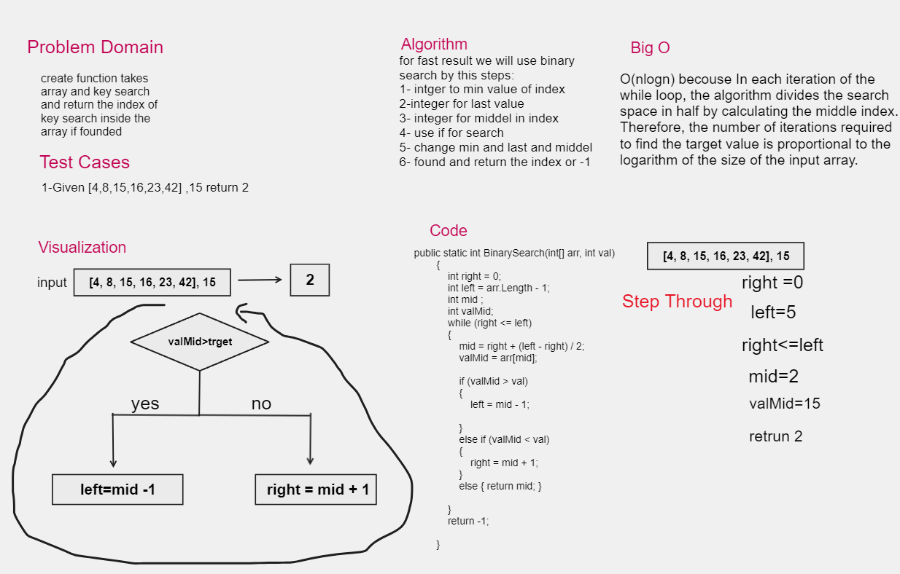

# BinarySearch
in this challenge we will take an integer array sorted and take int to search in array forit 
and if found return index of the key in the array and -1 if dont found
## Whiteboard Process

