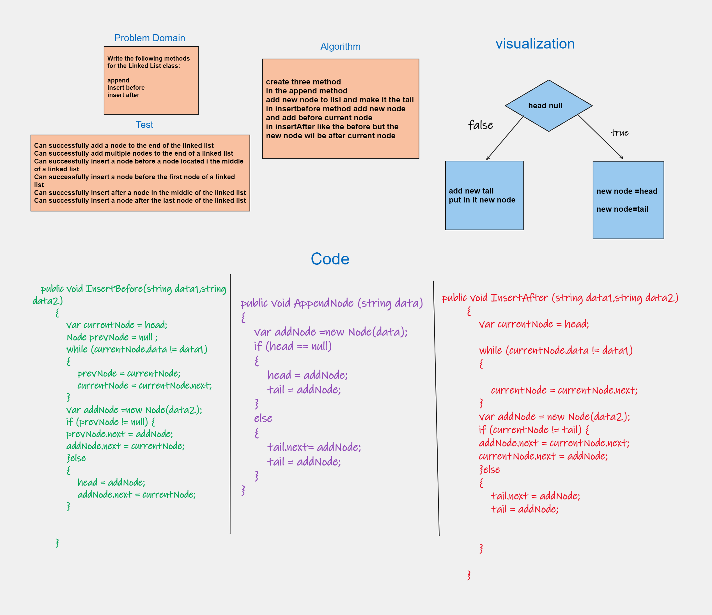
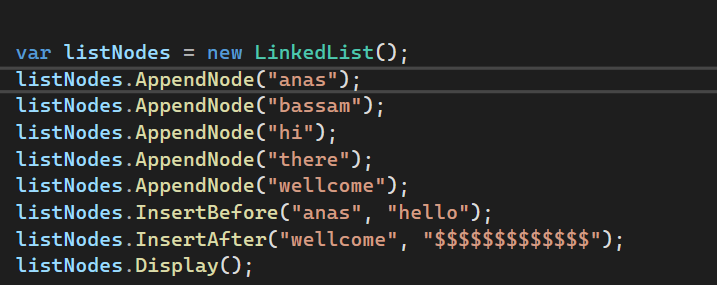
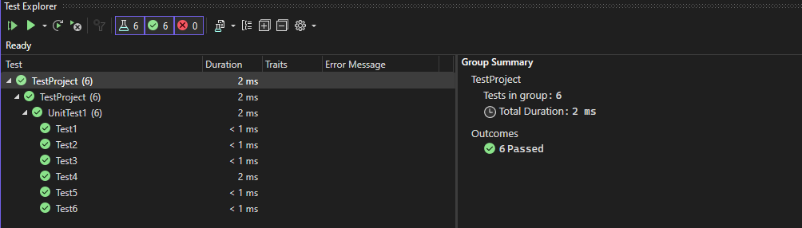

# Linked List Insertions

## Approach:

- The AppendNode method appends a new node at the end of the linked list. If the list is empty, it sets both the head and tail to the new node. Otherwise, it updates the tail's next pointer to the new node and updates the tail to the new node.
- The InsertBefore method inserts a new node with data2 before the node with data1. It iterates through the list until it finds the node with data1. It then creates a new node with data2 and updates the next pointers to insert the new node before the current node. If the current node is the head, it updates the head to the new node.
- The InsertAfter method inserts a new node with data2 after the node with data1. It iterates through the list until it finds the node with data1. It then creates a new node with data2 and updates the next pointers to insert the new node after the current node. If the current node is the tail, it updates the tail to the new node.

## Time Complexity:

- Appending a node (AppendNode): O(1) - It takes constant time to append a node at the end of the list.

- Inserting a node before a given node (InsertBefore): O(n) - In the worst case, where data1 is the last node or not present in the list, it iterates through all the nodes once.

- Inserting a node after a given node (InsertAfter): O(n) - In the worst case, where data1 is the last node or not present in the list, it iterates through all the nodes once.

