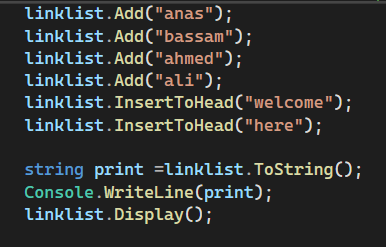
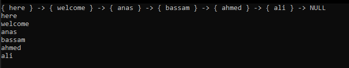

# Singly Linked Lists
in this challenge we create node class
and LinkList class and and node to list and insert and includes for value and convert all list to string 

## Whiteboard Process

## Approach & Efficiency
- InsertToHead:

This method inserts a new node with the given data at the beginning of the linked list.
The time complexity of this method is O(1) since it performs a constant number of operations, regardless of the size of the list.
The space complexity is also O(1) because it only requires the creation of a new node.

- Includes:

This method checks if a node with the given data exists in the linked list.
The time complexity of this method is O(n) in the worst case since it may need to traverse the entire list to find the node with the given data.
The space complexity is O(1) because it does not require additional memory that scales with the size of the list.
- ToString:

This method converts the linked list into a string representation.
The time complexity of this method is O(n) since it needs to iterate through each node in the list to construct the string.
The space complexity is O(n) because the resulting string length is proportional to the size of the list.

## Solution

