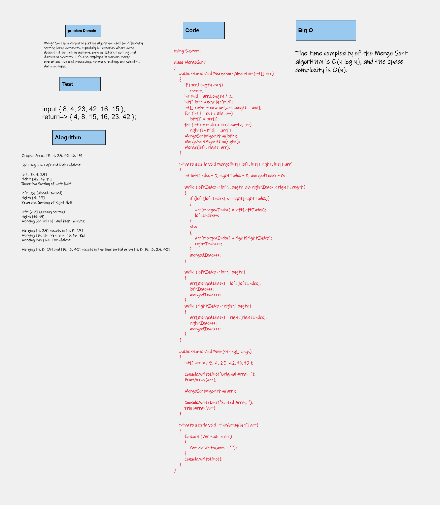
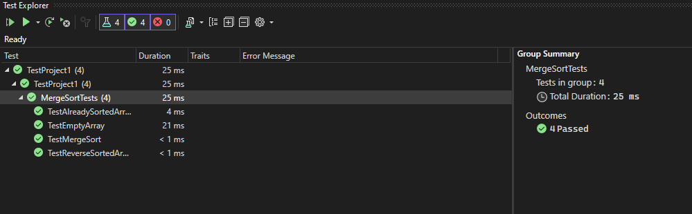
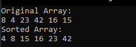

# Merge Sort
Merge Sort is a versatile sorting algorithm used for efficiently sorting large datasets, especially in scenarios where data doesn't fit entirely in memory, such as external sorting and database systems. It's also employed in various merge operations, parallel processing, network routing, and scientific data analysis.
## Whiteboard Process

