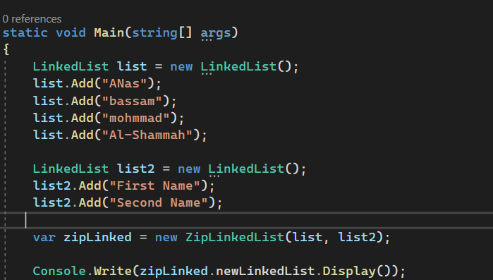
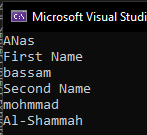

# linked-list-zip

## WhiteBoard 

## Approach & Efficiency
The time complexity of the given code is O(n), where n is the maximum number of nodes in either list or list2. This is because the code iterates through both lists simultaneously and adds the data from each node to the newLinkedList.

The space complexity of the given code is O(n), where n is the total number of nodes in the newLinkedList. This is because a new LinkedList newLinkedList is created to store the zipped result.

## Solution

