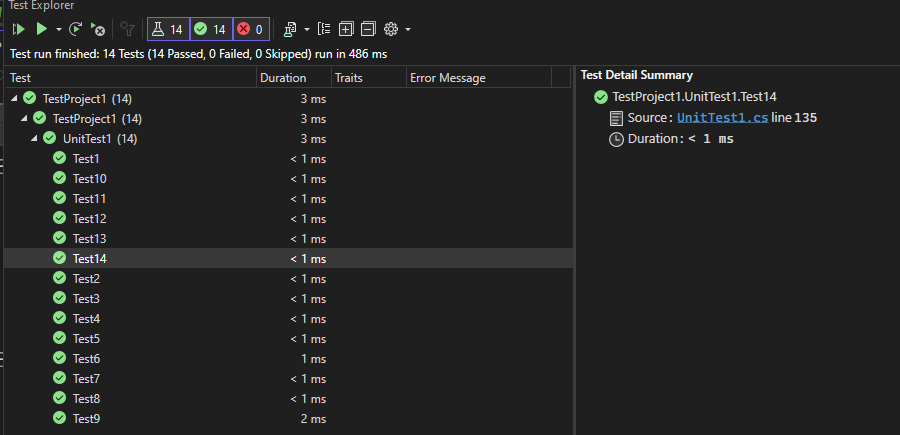

# Stack & Queue
Using a Linked List as the underlying data storage mechanism, implement both a Stack and a Queue

## Whiteboard Process

## Approach & Efficiency
# Stack and Queue Complexity Analysis

## Stack Class

- `Push` method:
  - Time complexity (Big O): O(1)
  - Space complexity: O(1)

- `Display` method:
  - Time complexity: O(n), where n is the number of elements in the stack.
  - Space complexity: O(1)

- `Pop` method:
  - Time complexity: O(1)
  - Space complexity: O(1)

- `Peek` method:
  - Time complexity: O(1)
  - Space complexity: O(1)

- `IsEmpty` method:
  - Time complexity: O(1)
  - Space complexity: O(1)

## Queue Class

- `Enqueue` method:
  - Time complexity: O(1)
  - Space complexity: O(1)

- `Dequeue` method:
  - Time complexity: O(1)
  - Space complexity: O(1)

- `Peek` method:
  - Time complexity: O(1)
  - Space complexity: O(1)

- `IsEmpty` method:
  - Time complexity: O(1)
  - Space complexity: O(1)

## Solution

