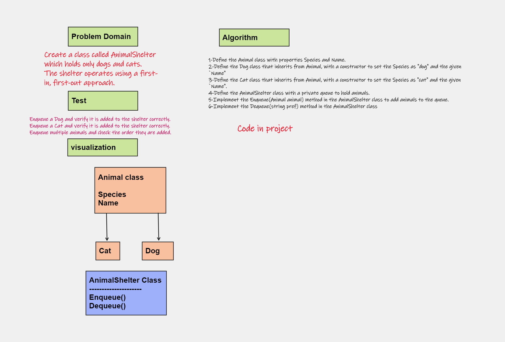
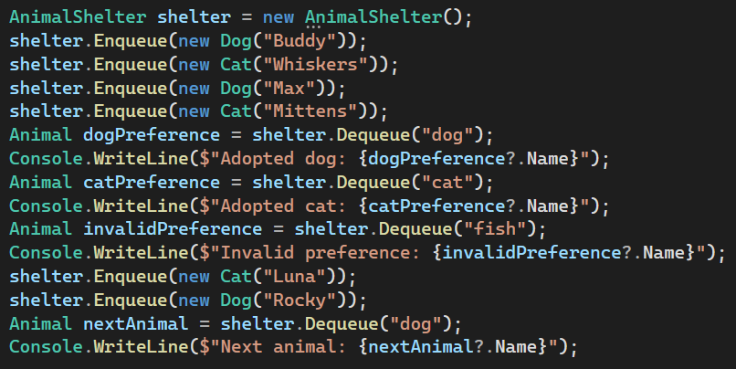
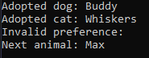

# stack-queue-animal-shelter
First-in, First out Animal Shelter.
## Whiteboard Process

## Approach & Efficiency
the enqueue method has a time and space complexity of O(1), while the dequeue method has a time complexity of O(n) and a space complexity of O(1).

## Solution

