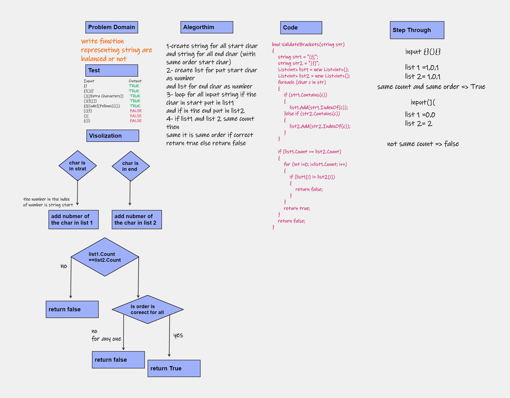
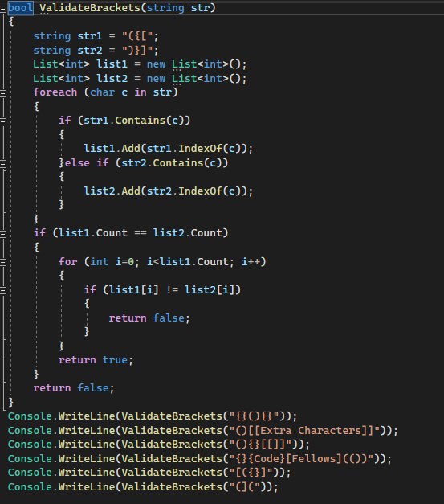
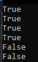

# stack-queue-animal-shelter
create function representing string are balanced or not
## Whiteboard Process

## Approach & Efficiency
Time complexity: O(n) becouse for loop for all N number of input
Space complexity: O(n) becouse store number in list as number of input in worst senaryo
## Solution

