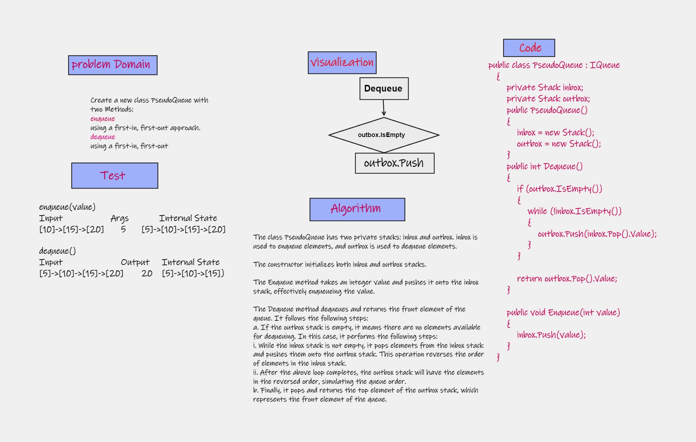
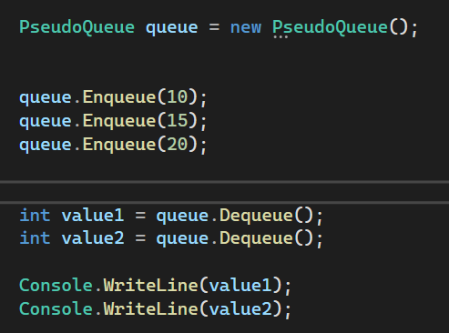
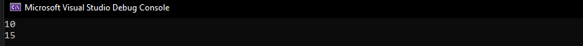

# stack-queue-pseudo
Using a Linked List as the underlying data storage mechanism, implement both a Stack and a Queue

## Whiteboard Process

## Approach & Efficiency
Time Complexity:

Enqueue operation: The Enqueue method simply pushes the element onto the inbox stack, which has a time complexity of O(1). This operation is independent of the number of elements already present in the queue.
Dequeue operation: The Dequeue method has a time complexity of O(n), where n is the number of elements in the queue. However, the transfer of elements from inbox to outbox only happens when outbox is empty, and each element is transferred only once. As a result, the amortized time complexity for the dequeue operation is O(1) on average.
Space Complexity:

The space complexity of the PseudoQueue class is O(n), where n is the number of elements in the queue. This is because both the inbox and outbox stacks may contain up to n elements at a time.
Overall, the enqueue operation has a time complexity of O(1), the dequeue operation has an amortized time complexity of O(1), and the space complexity is O(n).

## Solution

