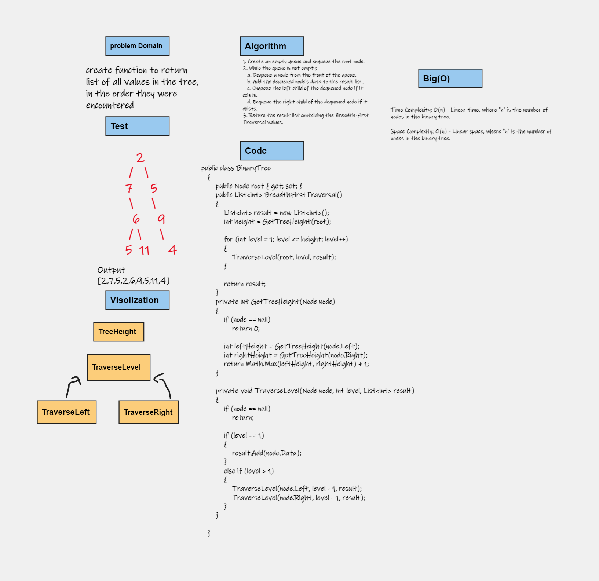
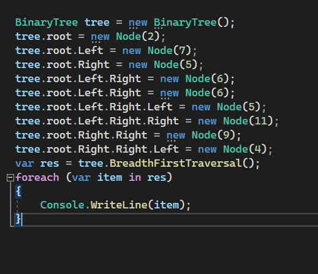
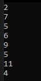
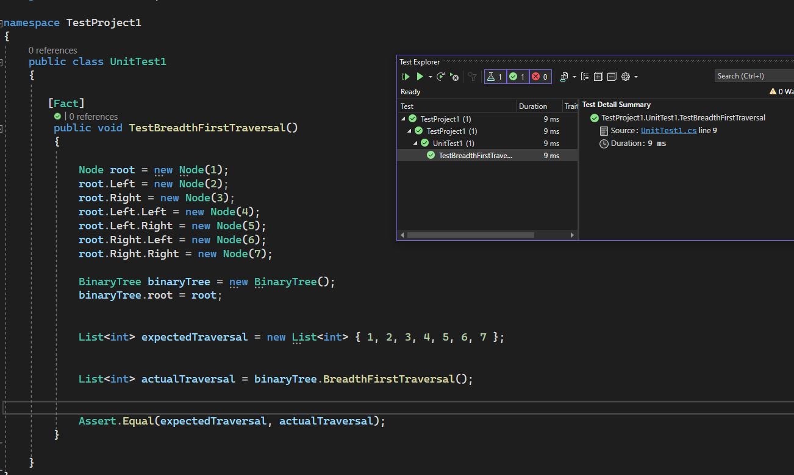

# Tree-max
create function to return  list of all values in the tree, in the order they were encountered
## Whiteboard Process

## Approach & Efficiency
Time Complexity: O(n) - Linear time, where "n" is the number of nodes in the binary tree.

Space Complexity: O(n) - Linear space, where "n" is the number of nodes in the binary tree.
## Solution

