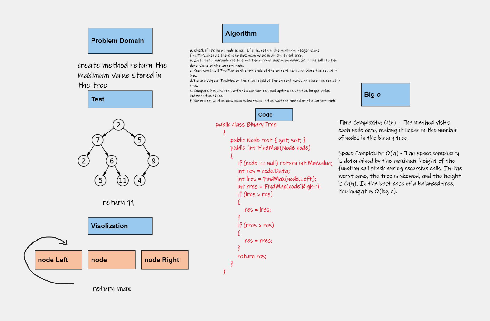
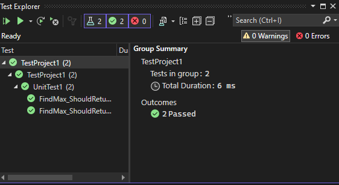
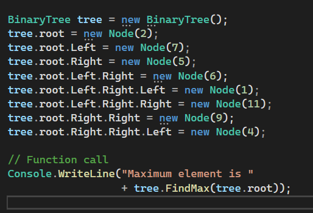
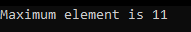

# Trees

## Whiteboard Process

## Approach & Efficiency
 the space complexity is O(n) due to the binary tree traversals and O(log n) in the average case for the Binary Search Tree operations. In the worst-case scenario for the Binary Search Tree, it could be O(n) if the tree is highly unbalanced.

## Solution

